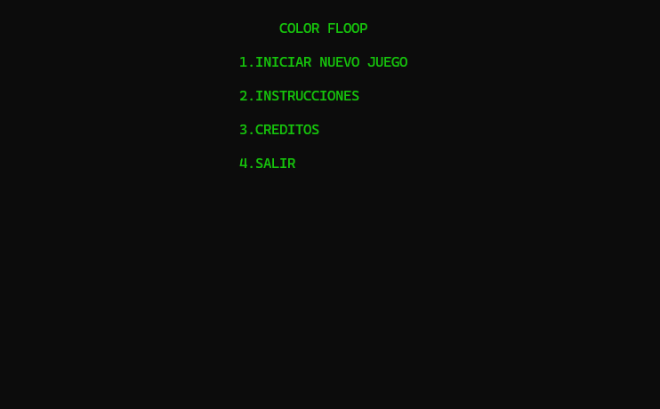

# Color Floop

Color Floop es un juego de consola para Windows inspirado en la mecanica de inundar un tablero de colores. El objetivo es convertir todo el tablero a un solo color empezando desde la esquina superior izquierda.

## Como ejecutar

El proyecto ya incluye un ejecutable compilado:

```powershell
cd C:\laragon\www\ColorFloop
.\proyecto_stefany_colorf.exe
```

Tambien puedes abrir `proyecto_stefany_colorf.exe` con doble clic desde el Explorador de Windows.

## Como jugar

1. En el menu principal selecciona `1.INICIAR NUEVO JUEGO`.
2. Elige la dificultad:
   - `1.FACIL`: tablero 10x10 con 25 movimientos.
   - `2.DIFICIL`: tablero 20x20 con 40 movimientos.
3. Durante la partida escribe el numero del color que quieres usar:
   - `1`: Blue
   - `2`: Red
   - `3`: Pink
   - `4`: Yellow
   - `5`: White
   - `6`: Green
4. El territorio conquistado empieza en la esquina superior izquierda. Cada color seleccionado expande ese territorio si hay bloques vecinos del mismo color.
5. Ganas si todo el tablero queda del mismo color antes de quedarte sin movimientos.
6. Presiona `0` para volver al menu.

## Requisitos

Para ejecutar el `.exe`:

- Windows.
- Consola de Windows, PowerShell o CMD.

Para compilar desde el codigo fuente:

- Un compilador C++ compatible con Windows, por ejemplo MinGW/MSYS2 o Visual Studio Build Tools.
- Soporte para las librerias usadas por el proyecto: `windows.h`, `conio.h` y `_conio.h`.

> Nota: el repositorio incluye el archivo `proyecto_stefany_colorf.cpp`, pero no incluye `_conio.h`. Si la compilacion falla por ese archivo, debes agregarlo al proyecto o adaptar el codigo para usar una alternativa disponible en tu compilador.

## Como compilar

Con MinGW, el comando base seria:

```powershell
g++ proyecto_stefany_colorf.cpp -o proyecto_stefany_colorf.exe
```

Luego ejecuta:

```powershell
.\proyecto_stefany_colorf.exe
```

Si quieres verificar que tienes `g++` instalado:

```powershell
g++ --version
```

DEMO:

```markdown

```